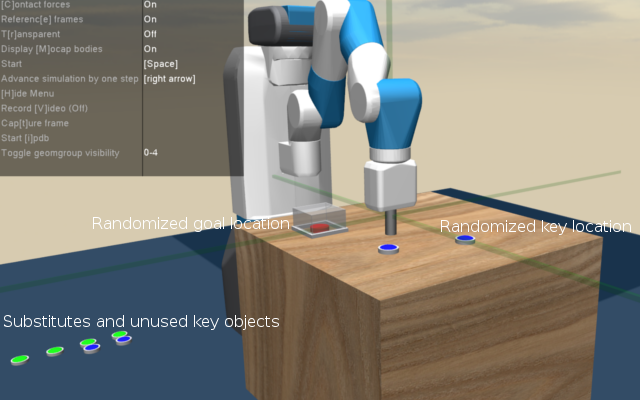

This environment provides a simple reacher-task. 
The robot has to reach the goal (aka object0, the red cylinder), 
but the goal is locked under the glass until the robot has reached the n-key-locations 
(aka object1-object4, the blue buttons).
You can specify the number of key-locations by setting n_objects to a number between 1 and 4.

Every time the robot reaches a key object, the button will be exchanged with a green variant,
which the robot does not see (it is not in _get_obs()). What it sees is that the key-object is moved
to the floor, where the green substitute was before.

When all key locations have been reached, the cover above the goal is removed and 
the goal is reachable.

